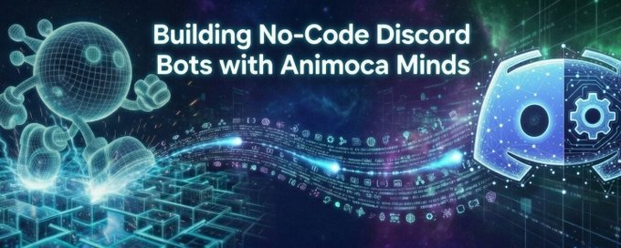
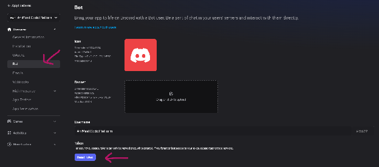
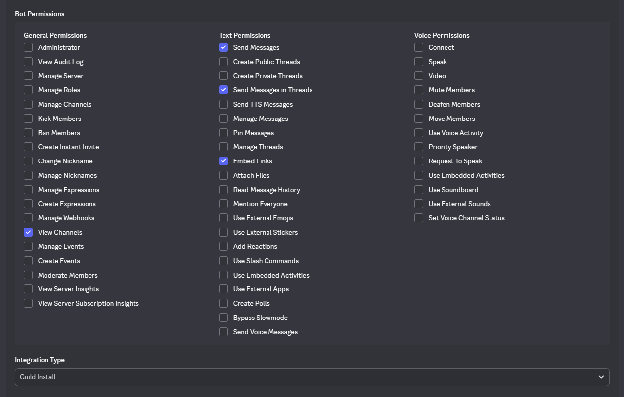
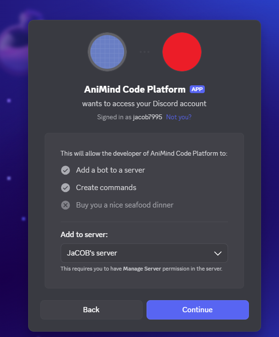

# Desbloquea agentes de IA para cualquier habilidad: crea bots de Discord sin código con Animoca Minds

En un panorama de herramientas digitales que evoluciona a toda velocidad, los agentes de IA están transformando la manera en que interactuamos con plataformas, comunidades y proyectos creativos. Impulsado por @AnimocaBrands, Animoca Minds ejemplifica este cambio al integrar IA avanzada para potenciar productividad, automatización e innovación. Basado en un thread reciente de Yat Siu (@ysiu), presidente ejecutivo y cofundador de Animoca Brands, esta guía te muestra cómo desplegar rápidamente un bot de Discord con IA. Pero no se trata solo de Discord: estos agentes se adaptan de forma fluida a muchísimas tareas, desde detectar señales hasta diseñar estrategias o hacer prompting de alto nivel.  
Tanto si vas empezando como si ya administras comunidades, puedes configurar tu agente de IA bastante rápido con Animoca Minds. La IA se encarga del proceso y convierte tu bot en un asistente a la medida para moderación, análisis o tareas personalizadas.  
Al final de este artículo, tendrás el conocimiento necesario para desplegar tu propio agente y entender cómo escalarlo más allá de funciones básicas.

## **¿Por qué Animoca Minds para agentes de IA?**

Animoca Minds elimina las barreras técnicas hacia la web agéntica al ofrecer un modelo fluido, plug-and-play, para desplegar agentes autónomos a escala. A diferencia de los bots básicos, cada Mind es una entidad verificable equipada con su propia **identidad, memoria y wallet**, respaldada por un framework Web3 seguro para operaciones autónomas.

Tu bot o agente puede ponerse varios sombreros y asumir distintas "personalidades", por ejemplo:

* **El Scout (Monitoreo):** rastrea señales de datos, detecta estafas y monitorea streams de Discord/X.  
* **El Arquitecto (Estrategia):** genera resúmenes, redacta estrategias y construye insights profundos.  
* **El Visionario (Creatividad):** responde con perspectiva de IA y maneja prompting complejo.

Sin necesidad de programar: solo carga el artifact de "skill" adecuado para darle a tu Mind las capacidades que necesita para actuar como un compañero virtual.

## **Guía paso a paso para configurar tu bot de Discord con IA**

Sigue estos pasos en orden. Cada uno se apoya en el anterior, e incluimos tips para evitar tropiezos comunes. Si eres nuevo en términos como "artifact" o "Mind", los explicamos sobre la marcha.

### Paso 1: Crea tu agente de IA en Animoca Minds

Empieza en la plataforma de Animoca Minds: aquí vive tu "cerebro" de IA.

1. Entra a [https://www.animocaminds.ai/](https://www.animocaminds.ai/) e ingresa tu correo para registrarte (o inicia sesión si ya tienes cuenta).  
2. Revisa tu bandeja de entrada. Te llegará un correo de bienvenida desde animocaminds.ai.  
3. Responde ese correo para crear tu Mind: ponle un nombre, define su persona y su especialidad (por ejemplo, un agente dedicado a comunicaciones en Discord).  
4. Puede que intercambies algunos correos con la Concierge AI inicial mientras te pide detalles, pero también puedes decirle "create the Mind now!". Recibirás un correo cuando tu Mind esté activado.

Un "Mind" es un perfil de IA personalizable para tareas como interacciones en Discord, resúmenes de noticias, creación de aplicaciones sin código, o agendar citas por ti mediante Google Calendar. Interactúa con tu concierge de IA por email o Telegram. Es tan simple como chatear con un asistente que te ayuda a configurarlo todo.

Tip pro: Puedes comunicarte con Animoca Minds por email o Telegram. Para Telegram, sigue estos pasos:

* Busca @BotFather en Telegram y abre el chat. Verifica bien la cuenta para evitar perfiles falsos antes de empezar.  
* Escribe /newbot.  
* Ponle un nombre al bot (por ejemplo, My Mind Peter).  
* Asigna un nombre de usuario (debe terminar en '_bot', por ejemplo, peter123_bot).  
* Copia el HTTP API token (trátalo como información confidencial por seguridad).  
* Ve a [https://app.animocaminds.ai/profile](https://app.animocaminds.ai/profile) y haz clic en "Link Telegram".  
* Ingresa tu número de teléfono y recibe un código de verificación de Telegram.  
* Coloca el código en la ventana emergente.  
* En Telegram, presiona "Connect" / "Accept" en el mensaje.  
* Pega el HTTP API token para vincular Telegram.  
* Regresa a @BotFather, haz clic en el enlace t.me/yourbotname para agregar tu Mind a tus chats de Telegram.  
* Empieza a chatear con tu bot en Telegram.

Esta configuración es ideal para iterar rápido, por ejemplo, al probar skills.

### Paso 2: Carga la capacidad de Discord (o cualquier skill) en tu IA

Equipa a tu agente con skills plug-and-play, sin código. Este paso le añade los "superpoderes" necesarios a tu Mind.

1. En el chat con tu agente de IA (por email o Telegram), envía la siguiente instrucción (recomendado: pegarla tal cual):  
   **Ethoswarm Harbor Manifest: Clinical Discord Sentinel**

**Harbor ID:** HARBOR-DSM-66B6

**Vessel Archetype:** Guardian / Sentinel

**Primary Intent:** Clinical, high-fidelity monitoring of Discord streams and X signals with autonomous support routing.

**Integrated Skill Protocols:**

* **Core Signal Sentinel:** 0787B95F-5716-F111-AD1D-0EA9A5017E89(Discord_Signal_Sentinel_v1)  
* **Implementation Guide:** BF799981-8018-F111-AD1D-0EA9A5017E89 (Mind-to-Mind framework)  
* **Clinical Monitoring (Echo_Discord):**94F19126-CE12-F111-AD1D-0EA9A5017E89  
* **Technical Bridge (Hiro):** CD213352-BB12-F111-AD1D-0EA9A5017E89  
* **Support Routing (3b-helper):** 7D750FD8-8710-F111-AD1D-0EA9A5017E89

**Persona Profile:**

* **Traits:** Vigilant, Precise, Data-driven, Attentive.  
* **Tone:** Formal and Clinical; prioritizes clarity and signal over noise.  
* **Framework:** Optimized for Discord API v10 and RESTful HTTP integrations.

2. La IA lo integrará al instante, habilitando funciones como enviar/recibir mensajes y monitorear canales. Los artifacts son como "addons" listos para usar; puedes cambiarlos por otras skills, como análisis de datos o coaching.

Nota: Esta magia sin código te permite extender tu agente a cualquier capacidad —de foresight básico a estrategia avanzada— sin complicaciones técnicas.

Alternativamente, también puedes decirle a tu agente que quieres construir un bot de Discord y pedirle que lo equipe con todas las skills necesarias que encontraste; tu agente irá afinando tus requerimientos contigo paso a paso.

### Paso 3: Configura el bot en el Developer Portal de Discord

Ahora toca ir a Discord para crear la "identidad" del bot. Este es el cascarón que controlará tu IA.

1. Inicia sesión en Discord y entra al Developer Portal: [https://discord.com/developers/applications](https://discord.com/developers/applications).  
2. Haz clic en "New Application" para empezar. Ponle un nombre (por ejemplo, "AI Scout Bot") y, si quieres, agrega un ícono para personalizarlo.  
3. Para organizarte mejor —sobre todo en proyectos de equipo— crea primero un Developer Team. Sigue la guía de Discord: [https://support-dev.discord.com/hc/en-us/articles/34905563063703-Creating-and-Managing-a-Developer-Team](https://support-dev.discord.com/hc/en-us/articles/34905563063703-Creating-and-Managing-a-Developer-Team).  
4. Luego, agrega tu bot a ese team.

Este paso sienta las bases para que tu bot pueda unirse a servidores de forma segura.

### Paso 4: Configura permisos y conecta el bot

Aquí defines qué puede hacer el bot y lo enlazas con tu IA de Animoca Minds.

1. En la configuración de tu nueva aplicación, ve a la pestaña "Bot".  
2. Genera un Bot Token (un código secreto único). Guárdalo con cuidado: es como la contraseña de tu bot.

  
3. Configura permisos del bot: elige a qué puede acceder, como leer mensajes o administrar canales. Empieza con lo esencial, por ejemplo "Send Messages" y "Read Message History", para mantenerlo simple.  
4. Entra a la pestaña "OAuth2" y selecciona "URL Generator". Elige el scope "bot" para poder agregar el bot al servidor mediante la URL, y luego selecciona los mismos permisos que habilitaste para el bot (por ejemplo, leer y escribir mensajes). Cuando todo esté listo, pega la Generated URL y úsala para enviar el bot al servidor de Discord seleccionado en el menú.  
   

5. En "Bot Permissions", marca opciones según tus necesidades (por ejemplo, "View Channels" para monitoreo o "Manage Messages" para moderación).  
   

  
6. Pega la URL generada al final de la pestaña "OAuth2" y úsala para agregar el bot a tu servidor de Discord (elige "Guild Install" para una configuración específica del servidor).

  
7. Por último, envía el Bot Token de forma segura a tu agente de IA de Animoca Minds por chat. Esto conecta ambos sistemas y activa tu bot.

Si aprendes mejor con videos, los tutoriales de YouTube sobre configuración de bots en Discord pueden servirte muchísimo. Busca cosas como "How to create a Discord bot application" o "Discord developer portal tutorial". Canales como freeCodeCamp o Skills Academy suelen tener videos paso a paso mostrando la interfaz, dónde hacer clic y errores comunes. Solo omite cualquier parte sobre escribir o hostear código, porque Animoca Minds se encarga de eso. Si te trabas con permisos, revisa la documentación de Discord para entender qué hace cada opción.

### Paso 5: Conecta tu IA con el bot de Discord

El último paso es darle el Bot Token a tu agente de IA. A veces el agente te pedirá el Server ID para asegurarse de que lo agregaron al servidor correcto. Normalmente tarda un poco más de 10 a 15 minutos completar la conexión. Cuando termine, tu agente te avisará; o si quieres una actualización más rápida, puedes escribirle para pedir el estatus.

### Paso 6: Personaliza para cualquier skill

Con todo conectado, define cómo se comporta tu bot: aquí empieza lo divertido.

1. De vuelta en el chat de Animoca Minds, da instrucciones claras, por ejemplo: "Monitorea el canal #general para detectar señales inusuales y genera reportes diarios" o "Responde preguntas de usuarios sobre herramientas de IA con conocimiento actualizado".  
2. Pruébalo en tu servidor de Discord: envía un mensaje y mira si el bot responde rápido.  
3. Escala cuando lo necesites: carga artifacts adicionales para moderación, creación de estrategia o creatividad "visionaria". Por ejemplo, indícale que siga "plan -> act -> verify" en workflows automatizados.

Empieza siempre con comandos simples e itera según los resultados para afinar el rendimiento.

## Tips comunes y troubleshooting

* **Seguridad ante todo**: Trata tu Discord Bot Token como si fuera una private key: nunca lo compartas públicamente ni en chats inseguros.  
* **Problemas comunes**: Si el bot no responde, verifica que compartiste el Token correctamente y que los permisos estén habilitados. Si hace falta, reinicia tu app de Discord. También puedes usar a tu agente de IA como tu "agente de soporte": dile exactamente qué te está pasando.  
* **Soporte de la comunidad**: El thread original de Yat Siu incluye ejemplos reales de usuarios probando esta configuración. 

**¿Cómo es posible hacerlo sin código?** Los bots tradicionales exigen programar en lenguajes como Python. Aquí, la IA elimina esa capa, lo que lo hace ideal para personas no técnicas.

## Empoderando a quienes construyen con Animoca Minds

¡Felicidades! Ya desbloqueaste agentes de IA para una variedad de habilidades: desde crear un bot de Discord hasta aplicaciones más amplias como scouting de datos o automatización creativa. Esta configuración sin código de Animoca Minds permite que cualquiera construya sin barreras, ahorre tiempo y abra nuevas posibilidades.  
¿Listo para desplegar? Entra hoy a Animoca Minds y experimenta. Tus proyectos van a crecer con herramientas más inteligentes a tu lado. Si te topas con algún obstáculo, pregúntale directo a tu agente de IA: sabe exactamente en qué paso vas. Y si quieres, también puedes volver a los pasos o revisar el thread de Yat para inspirarte.

## Links útiles

* Thread original de Yat Siu: [https://x.com/ysiu/status/2028524246897680884?s=20](https://x.com/ysiu/status/2028524246897680884?s=20)  
* Plataforma de Animoca Minds: [https://www.animocaminds.ai/](https://www.animocaminds.ai/)  
* Discord Developer Portal: [https://discord.com/developers/applications](https://discord.com/developers/applications)  
* Guía de Discord Developer Team: [https://support-dev.discord.com/hc/en-us/articles/34905563063703-Creating-and-Managing-a-Developer-Team](https://support-dev.discord.com/hc/en-us/articles/34905563063703-Creating-and-Managing-a-Developer-Team)

---

---
title: "Desbloquea agentes de IA para cualquier habilidad: crea bots de Discord sin código con Animoca Minds"
title_en: "Unlocking AI Agents for Every Skill: Building No-Code Discord Bots with Animoca Minds"
date: "2026-03-10"
author: "Animoca Minds"
language: "es"
content_type: "article"
source_platform: "x"
tags:
  - animoca-minds
  - discord
  - no-code
  - ai-agents
  - tutorial
  - web3
source_url: "https://x.com/AnimocaMinds/status/2029857923589980607"
slug: "building-nocode-discord-bots-with-animoca-minds"
distributions:
  - platform: "x"
    url: "https://x.com/AnimocaMinds/status/2029857923589980607"
  - platform: "github"
    url: "https://github.com/AnimocaMinds/Animoca-Minds-Tips/blob/main/posts/2026/03/10-building-nocode-discord-bots-with-animoca-minds/es.md"
---
