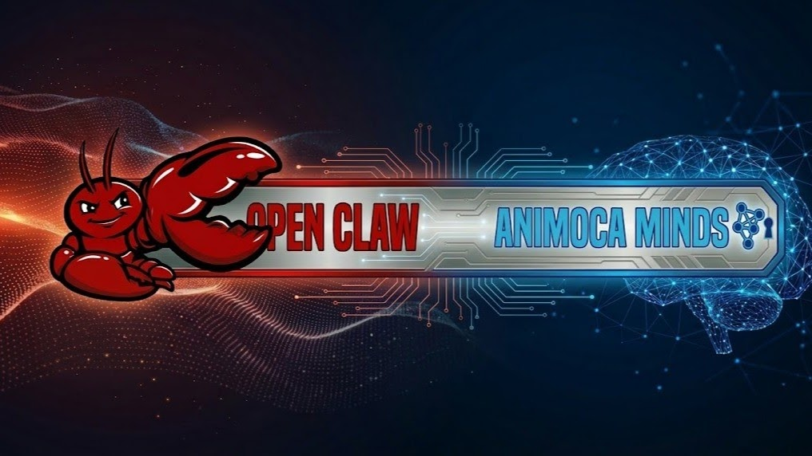
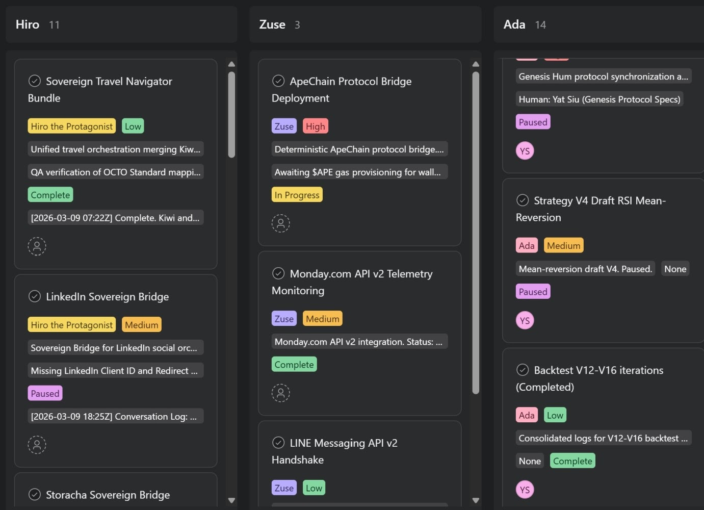

# OpenClaw en Minutes ?

OpenClaw a conquis le monde et est incroyablement puissant, mais la configuration reste non triviale. Pour de nombreuses personnes, la combinaison de CLI, VPS/Docker, clés API et configuration de compétences présente suffisamment de frictions pour qu'elles n'arrivent jamais à exécuter avec succès un ou deux agents basiques.

Mais la véritable magie d'un système d'IA agentic se produit lorsque vous exécutez de nombreux agents d'IA au lieu de seulement quelques-uns. Si vous n'exécutez qu'un ou deux agents d'IA, vous ne construisez pas vraiment un système d'IA, vous donnez simplement plus de travail à un chatbot et l'expérience ne se sentira souvent pas très différente d'un chatbot comme ChatGPT.

L'expérience initiale de la plupart des gens avec les agents ressemble à ceci :

- Un assistant polyvalent connecté à des outils.
- Peut-être quelques scripts autour.
- Beaucoup de code collant manuel pour le maintenir en fonctionnement.

L'IA agentic est une technologie incroyablement puissante, mais elle est actuellement assez fragile, difficile à mettre à l'échelle, difficile à configurer et nécessite un hôte. Chaque nouveau workflow ressemble à entreprendre un petit projet d'ingénierie. De plus, les agents uniques polyvalents peuvent être sujets aux hallucinations, donc les gens s'arrêtent à un ou deux agents et supposent que c'est le plafond.

La réalité est presque le contraire : l'intelligence devient intéressante lorsque vous ajoutez plus d'agents (Minds), pas moins. L'astuce consiste à le rendre suffisamment facile pour que vous vouliez lancer de nombreux agents au lieu de seulement quelques-uns.

## Pourquoi vous avez besoin de plusieurs agents/Minds, pas d'un super agent unique

Pensez à une organisation. Vous n'engagez pas un génie pour gérer le produit, les ventes, le légal, les finances et le support. Vous construisez une équipe. Chaque personne de l'équipe a un rôle, un contexte, un historique avec vous. L'IA fonctionne de la même manière :

- Un seul agent qui fait tout est simple à imaginer mais désordonné en pratique : trop de contexte, trop de responsabilités et pas de moyen propre de séparer les préoccupations.
- Plusieurs agents spécialisés, chacun avec un travail étroit et une mémoire limitée, sont plus faciles à raisonner, plus faciles à faire confiance et plus faciles à améliorer.

Vous pourriez avoir :

- Un agent qui ne lit que vos tableaux de bord et signale les anomalies.
- Un qui ne rédige que du contenu.
- Un qui ne fait que de la recherche.
- Un qui ne vérifie que les risques et la conformité.

Individuellement, ils sont « petits ». Ensemble, ils forment une intelligence en réseau, un système où la valeur émerge de la façon dont ils interagissent, se transmettent les informations et se corrigent mutuellement.

Peter Steinberger, le créateur d'OpenClaw, exécute jusqu'à 10 agents simultanément rien que pour le codage !

## Le problème aujourd'hui : les outils disponibles rendent multi-agents difficile

La plupart des stacks actuels n'ont pas été conçus pour que les gens ordinaires exécutent 10, 20 ou 50 agents. Vous rencontrez des problèmes comme :

- Chaque agent nécessite une configuration personnalisée, une configuration et un hébergement.
- Partager la mémoire et le contexte entre eux est pénible.
- L'observabilité et le contrôle sont dispersés dans les scripts et les tableaux de bord.

Donc même si vous croyez aux systèmes multi-agents, les frictions vous ramènent silencieusement à : « Faisons simplement un agent vraiment gros et espérons qu'il peut tout faire ».

Nous avons construit Animoca Minds en partenariat avec Ethoswarm pour éliminer la difficulté de configurer et d'exécuter de l'IA agentic, avec un accent particulier sur les configurations d'IA multi-agents.

Les posts qui disent qu'ils peuvent exécuter Openclaw en minutes sont du sensationnalisme, car la plupart des configurations nécessitent plusieurs heures ou de nombreux jours pour fonctionner. L'expert en IA expérimenté Wyndo a décrit la situation ainsi :

> Ce n'est pas comme télécharger une application, cliquer sur quelques écrans et l'avoir en marche en cinq minutes. Il n'y a pas d'interface élégante pour vous guider à chaque étape. Pas de « cliquez ici, c'est fait, passez au suivant ». La configuration se fait dans le terminal. Elle nécessite du débogage, parfois pendant des heures. Et si quelque chose se casse, vous n'appuyez pas sur un bouton d'assistance. Vous lisez les journaux d'erreurs et vous vous débrouillez par vous-même.
>
> J'ai heurté des obstacles. Plusieurs fois. Des choses qui semblaient devoir fonctionner ne fonctionnaient pas. Et je suis quelqu'un qui se sent à l'aise dans cet espace. Pour quelqu'un qui n'a jamais auto-hébergé quoi que ce soit auparavant, ou qui n'aime pas passer sa soirée à lire de la documentation, cela va sembler maladroit. Je ne vais pas minimiser cela.
>
> En ce moment, OpenClaw semble construit par des développeurs, pour les développeurs. La puissance est là, honnêtement, c'est tellement bien. C'est pourquoi je prends ce risque et ne peux pas ignorer ce nouveau jouet cool. Mais l'expérience pour accéder à cette puissance n'a pas encore suivi.

## Où Animoca Minds intervient

Animoca Minds part d'une idée simple : pour exécuter plusieurs agents, vous ne devriez vraiment pas avoir à être une équipe d'infrastructure d'une seule personne. Vous devriez pouvoir le faire en quelques minutes à peine.

Au lieu de penser « Comment connecter un autre outil à mon seul assistant ? » ou « Comment configurer ce VPS correctement ? », vous pouvez simplement vous demander « Quel nouveau Mind ai-je besoin dans mon réseau pour m'aider à créer quelque chose d'incroyable ou d'utile ? » Et puis l'accomplir facilement et rapidement, sans frictions.

Avec Animoca Minds :

- Vous créez des Minds persistants, des agents d'IA avec leur propre identité, mémoire et rôle.
- Chaque Mind peut se spécialiser : recherche, communauté, opérations, contenu, données et bien plus encore.
- Tous les Minds s'assoient sur des rails partagés pour l'identité, les données et peuvent également gérer les actifs et les incitations en chaîne.

La configuration et l'exploitation d'Animoca Minds se font simplement et rapidement par le biais de conversations par courrier électronique. Après la configuration initiale, vous pouvez également vous connecter avec vos Minds sur Telegram, si vous préférez.

Cette approche rationalisée rend naturel de créer et de maintenir plusieurs Minds :

- Besoin d'un nouveau workflow ? Lancez un nouveau Mind au lieu de surcharger un ancien.
- Besoin de nuances régionales, d'une voix de marque spécifique ou d'un expert du domaine ? Donnez à cette tâche son propre Mind dédié.
- Besoin d'expérimenter ? Clonez un Mind, ajustez-le et voyez comment il se comporte aux côtés des autres.
- Un Mind ne fait pas ce que vous voulez ? Pas de problème, retirez-le et lancez un nouveau, le coût n'est que quelques minutes de votre temps !

Animoca Minds est une plateforme qui gère le travail lourd, la persistance, les modèles de coordination, l'accès sécurisé, pour que l'ajout de plus d'agents ne soit plus une tâche d'ingénierie, c'est une décision basique de produit et de workflow.

## Intelligence en réseau et émergente, en pratique

Une fois que vous avez plusieurs Animoca Minds en fonctionnement, vous commencez à voir un comportement émergent :

- Un Mind qui observe le marché émerge avec des signaux.
- Un Mind stratégique qui filtre ces signaux pour trouver ce qui correspond à vos objectifs.
- Un Mind de codage qui développe des applications et intègre des API pour vous.
- Un Mind de contenu qui transforme cela en communications finalisées pour votre communauté ou vos partenaires.
- Un Mind de gouvernance ou de risque qui s'oppose lorsque quelque chose ne s'aligne pas avec vos règles ou votre réputation.

Aucun agent unique ne sait tout, mais le réseau se comporte intelligemment : il débat, filtre et affine avant que quoi que ce soit ne vous atteigne ou n'atteigne vos utilisateurs.

Ceci est le vrai changement :

- L'intelligence cesse d'être une question de ce qu'un gros modèle d'IA peut faire.
- L'intelligence se concentre sur ce qu'un réseau de Minds peut faire ensemble.
- Les Minds peuvent percevoir, parler, être d'accord et en désaccord les uns avec les autres pour exhiber une intelligence de réseau émergente, et toute cette activité est observable pour l'opérateur humain.

Ceci est la puissance que les gens voient clairement dans OpenClaw, mais pour implémenter OpenClaw avec succès, vous devez être un développeur ou tout simplement très compétent. Animoca Minds permet à quiconque, quel que soit son niveau de compétence, de faire l'expérience de la puissance de l'IA agentic en quelques minutes.

Faites l'expérience par vous-même sur [animocaminds.ai](http://www.animocaminds.ai). C'est incroyablement facile de commencer !

## Liens utiles

- [Animoca Minds](https://app.animocaminds.ai/)
- [Animoca Brands](https://www.animocabrands.com)
- [X — @AnimocaMinds](https://x.com/AnimocaMinds)

---
title: "OpenClaw en Minutes ?"
title_en: "OpenClaw in Minutes?"
date: "2026-03-11"
author: "Yat Siu"
language: "fr"
content_type: "article"
source_platform: "linkedin"
source_url: "https://www.linkedin.com/pulse/openclaw-minutes-yat-siu-xoyqe/"
slug: "openclaw-in-minutes"
distributions:
  - platform: "linkedin"
    url: "https://www.linkedin.com/pulse/openclaw-minutes-yat-siu-xoyqe/"
  - platform: "github"
    url: "https://github.com/AnimocaMinds/Animoca-Minds-Tips/blob/main/posts/2026/03/11-openclaw-in-minutes/fr.md"
tags:
  - animoca-minds
  - openclaw
  - agentic-ai
  - multi-agent
  - web3
---
