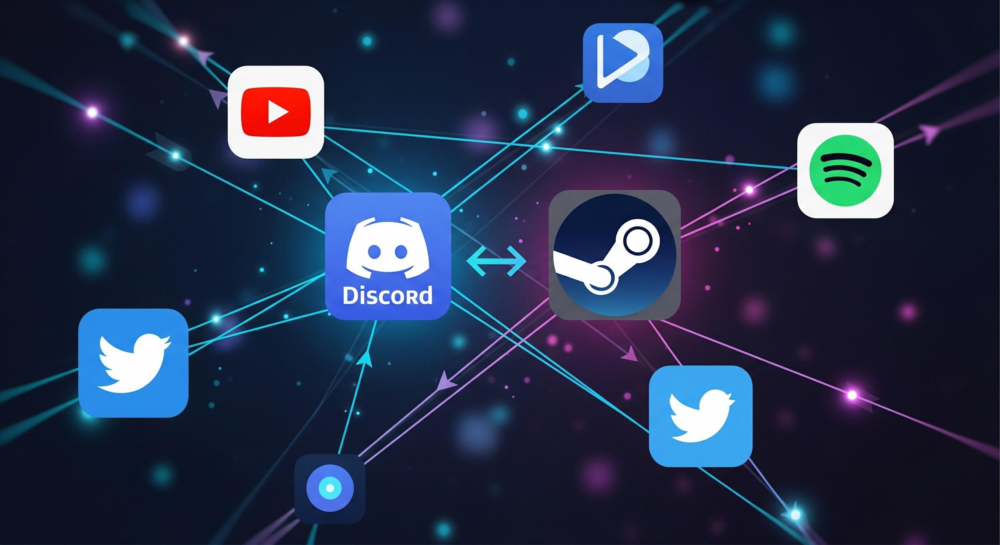

# Guide pour Configurer un Bot Discord de Surveillance des Actualités Steam avec Animoca Minds

Maintenir votre communauté de joueurs informée des actualités Steam ne nécessite plus d'efforts manuels ni de compétences en programmation. Ce guide vous explique comment configurer une automatisation sans code avec [Animoca Minds](https://www.animocaminds.ai/) pour surveiller le flux RSS de [Steam](https://store.steampowered.com/) et publier automatiquement des résumés quotidiens — que ce soit dans un canal Discord ou dans votre boîte de réception.

Le système connecte trois composants principaux : le flux RSS de Steam, la plateforme IA Animoca Minds et votre canal de notification préféré. Aucune programmation n'est requise ; l'agent IA gère la surveillance, le résumé et la publication en votre nom.

## Pourquoi utiliser Animoca Minds pour surveiller les actualités Steam ?

Animoca Minds simplifie l'automatisation par l'IA, transformant des tâches complexes comme l'analyse de flux RSS et la publication planifiée en instructions en langage naturel. Pour les communautés de jeux, les mises à jour en temps opportun sur les sorties, les ventes ou les correctifs peuvent considérablement augmenter l'engagement sans exiger de ressources de développement.

Votre agent automatisé peut :

- Scanner les [flux RSS de Steam](https://store.steampowered.com/feeds/news.xml) pour de nouveaux articles ou annonces
- Générer des résumés quotidiens concis filtrés par genre ou mot-clé
- Publier automatiquement des mises à jour dans un canal Discord ou les envoyer par e-mail
- S'adapter aux préférences changeantes grâce à des instructions de suivi simples

## Prérequis

Avant de commencer, assurez-vous d'avoir :

- Un serveur Discord où vous avez des permissions d'administration ou de gestion des bots (requis pour la diffusion Discord)
- Un compte [Animoca Minds](https://www.animocaminds.ai/)

## Étape 1 : Créer et configurer votre bot Discord

Cette étape s'applique si vous souhaitez que les mises à jour soient publiées dans un canal Discord. Si vous préférez la livraison par e-mail, passez directement à l'Étape 2.

### 1.1 Créer l'application

1. Accédez au [Discord Developer Portal](https://discord.com/developers/applications).
2. Cliquez sur **New Application**.
3. Entrez un nom pour votre bot (ex. : "Steam News Monitor") et cliquez sur **Create**.

### 1.2 Obtenir le token du bot

1. Dans la barre latérale gauche, naviguez vers l'onglet **Bot**.
2. Cliquez sur **Add Bot** (ou **Reset Token** si le bot existe déjà).
3. Copiez le token et conservez-le en lieu sûr — vous en aurez besoin lors de la configuration de votre Animoca Mind.

### 1.3 Définir les permissions du bot

1. Allez dans **OAuth2 → URL Generator**.
2. Sous Scopes, sélectionnez **bot**.
3. Activez ces permissions : **Send Messages**, **Embed Links** et **Read Message History**.
4. Copiez l'URL d'invitation générée pour ajouter le bot à votre serveur.

> **Conseil de sécurité :** N'accordez que les permissions minimales nécessaires à votre bot. Consultez le [guide des permissions Discord](https://support-dev.discord.com/hc/en-us/articles/34905563063703) pour plus de détails.

## Étape 2 : Configurer votre Animoca Mind

1. Visitez [animocaminds.ai](https://www.animocaminds.ai/) et connectez-vous ou créez un compte.
2. Vérifiez votre boîte de réception pour l'e-mail de bienvenue d'Animoca Minds (attendez jusqu'à 5 minutes).
3. Répondez pour commencer à configurer un nouveau Mind. Définissez :
   - **Nom :** ex. "Steam Scout"
   - **Personnalité :** ex. "expert en actualités gaming"
   - **Spécialité :** ex. "surveillance RSS et publication Discord"
4. Le Concierge AI peut poser des questions de précision. Pour accélérer, répondez : *"Créez le Mind maintenant."*
5. Vous recevrez une confirmation une fois votre Mind prêt.

## Étape 3 : Charger la compétence Steam et donner des directives

1. Dans votre conversation avec l'agent IA, demandez-lui de charger la compétence Steam :
   > *"Charge l'artefact Steam_Web_API_v1"*

   Vous pouvez le trouver dans le [Bazar Animoca Minds](https://app.animocaminds.ai/bazaar/skills/840E8213-2817-F111-AD1D-0EA9A5017E89). Si l'ID de l'artefact a changé, demandez : *"Liste les artefacts Steam disponibles."*

2. Si vous utilisez Discord, partagez votre **Token de bot Discord** avec le Mind comme identifiant sécurisé.

3. Fournissez vos directives initiales. Exemples :
   - *"Donne-moi les actualités quotidiennes de Steam couvrant les jeux Action, Action RPG et RPG."*
   - *"Informe-moi sur l'état du service Steam dans la région de Hong Kong."*
   - *"Publie un résumé quotidien des actualités Steam dans mon canal Discord chaque matin à 9h."*

## Étape 4 : Tester et personnaliser

1. Envoyez une instruction de test à votre Mind :
   - Discord : *"Génère un exemple de résumé d'actualités Steam et publie-le dans mon canal Discord."*
   - E-mail : *"Génère un exemple de résumé d'actualités Steam et envoie-le-moi par e-mail."*
2. Vérifiez votre canal Discord ou votre boîte de réception pour la mise à jour.
3. Affinez en ajoutant des filtres, ex. : *"N'inclure que les actualités sur les jeux 'Souls-like' ou 'Monde Ouvert'."*
4. Votre Mind conserve les instructions entre les sessions, donc les mises à jour sont cumulatives.

## Liens utiles

- [Animoca Minds](https://www.animocaminds.ai/)
- [Discord Developer Portal](https://discord.com/developers/applications)
- [Steam Store](https://store.steampowered.com/)
- [Flux RSS d'actualités Steam](https://store.steampowered.com/feeds/news.xml)
- [Compétence Steam dans le Bazar Animoca Minds](https://app.animocaminds.ai/bazaar/skills/840E8213-2817-F111-AD1D-0EA9A5017E89)
- [Guide des permissions des bots Discord](https://support-dev.discord.com/hc/en-us/articles/34905563063703)

---
title: "Guide pour Configurer un Bot Discord de Surveillance des Actualités Steam avec Animoca Minds"
title_en: "Guide to Setting Up a Steam News Monitoring Discord Bot with Animoca Minds"
date: "2026-03-15"
author: "Animoca Minds"
language: "fr"
content_type: "article"
source_platform: "x"
source_url: "https://x.com/AnimocaMinds/status/2032407420073623613"
slug: "setting-up-steam-news-monitoring-animoca-minds"
distributions:
  - platform: "x"
    url: "https://x.com/AnimocaMinds/status/2032407420073623613"
  - platform: "github"
    url: "https://github.com/AnimocaMinds/Animoca-Minds-Tips/blob/main/posts/2026/03/15-setting-up-steam-news-monitoring-animoca-minds/fr.md"
tags:
  - animoca-minds
  - steam
  - gaming
  - discord-bot
  - rss-monitoring
  - automation
  - no-code
---