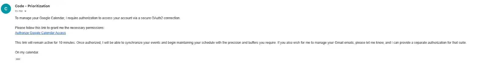

# Connecting Animoca Mind to Google Calendar

Either you run the day or the day runs you. With Animoca Minds, your AI agent can connect to Google Calendar and autonomously manage your schedule — meetings, events, and reminders — without you lifting a finger. This is agentic AI: tools that think, act, and execute for you.

## Step 1: Awaken Your Mind ⚡

**New users:** Go to [AnimocaMinds.ai](https://app.animocaminds.ai), enter your email, reply to the Concierge AI, name your Mind, and set its personality and specialty.

**Existing users:** Create a new Mind, then name it and set its specialty.

Next, equip your Mind with the **Google Calendar skill** in the Bazaar:
[https://app.animocaminds.ai/bazaar/apps/6750ADAF-BB06-F111-AD1D-0EA9A5017E89](https://app.animocaminds.ai/bazaar/apps/6750ADAF-BB06-F111-AD1D-0EA9A5017E89)

Once equipped, your Mind will start preparing the connection automatically. Just send the setup message, and it'll handle the rest.

## Step 2: Authorize Google Calendar Access 🔑

Your Mind will generate a secure authorization link. Click it and approve access.

⚠️ The link expires in 10 minutes. If it does, ask your Mind to retry.

Once approved, your Mind can read and manage events in your calendar without manual updates. 🗓️

## Step 3: Define a Mission 🎯

Tell your Mind what you want it to do. Examples:

- Check upcoming events
- Schedule meetings
- Organize your calendar

Your Mind doesn't just follow commands. It proactively manages your time so you can focus on what matters most.

## Step 4: Connected. Streamlined. Done. ✅

Your Google Calendar events are now syncing automatically. Your Mind acts, executes, and delivers for you. This is agentic AI in action: persistent digital workers that think, act, and transact on your behalf.

**Hot tip:** Your Mind is now ready to make your day easier — just give it instructions and watch it work!

## Useful links

- [Animoca Minds App](https://app.animocaminds.ai/)
- [Google Calendar Skill in the Bazaar](https://app.animocaminds.ai/bazaar/apps/6750ADAF-BB06-F111-AD1D-0EA9A5017E89)

---
title: "Connecting Animoca Mind to Google Calendar"
title_en: "Connecting Animoca Mind to Google Calendar"
date: "2026-03-16"
author: "Animoca Minds"
language: "en"
content_type: "thread"
source_platform: "x"
source_url: "https://x.com/AnimocaMinds/status/2032027894147661835"
slug: "connecting-animoca-mind-google-calendar"
distributions:
  - platform: "x"
    url: "https://x.com/AnimocaMinds/status/2032027894147661835"
  - platform: "github"
    url: "https://github.com/AnimocaMinds/Animoca-Minds-Tips/blob/main/posts/2026/03/16-connecting-animoca-mind-google-calendar/en.md"
tags:
  - animoca-minds
  - google-calendar
  - agentic-ai
  - scheduling
  - automation
---