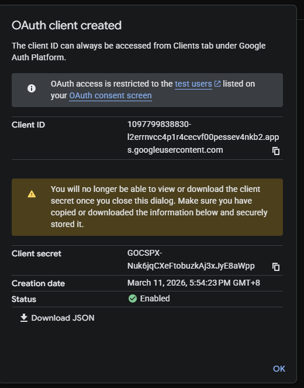

# Guide : Équiper votre Animoca Mind avec l'accès à Google Drive

Ce guide fournit les étapes exactes pour connecter votre Animoca Mind à Google Drive, lui accordant la capacité de créer, lire et modifier des documents.

## Phase 1 : Installer la compétence

2. Équipez cette application à votre Mind en copiant le prompt.

## Phase 2 : Créer un projet Google Cloud et activer les APIs

1. Rendez-vous sur la [Console Google Cloud](https://console.cloud.google.com/) et connectez-vous.
2. Créez un nouveau projet.
3. Activez dans **"APIs et services"** : Google Drive API, Google Docs API, Google Sheets API.

## Phase 3 : Générer les identifiants OAuth

1. Cliquez sur **"Créer des identifiants"** → **ID client OAuth**.
2. App type: Application Web. URI de redirection (tests): https://developers.google.com/oauthplayground
3. Téléchargez le fichier **"Client Secret JSON"**.

## Phase 4 : Générer le code d'autorisation et les tokens

1. Rendez-vous sur le [Google OAuth 2.0 Playground](https://developers.google.com/oauthplayground/).
2. Scope: `https://www.googleapis.com/auth/drive` → **Authorize APIs**.
3. Échangez le code contre des tokens: **[Refresh token]** et **[Access token]**.

## Phase 5 : Fournir les identifiants à votre Mind

1. Retournez sur [https://app.animocaminds.ai/](https://app.animocaminds.ai/).
2. Fournissez: [Code d'autorisation], [Access token], [Refresh token], Client Secret JSON.

Votre Mind pourra désormais créer, lire et écrire des fichiers dans votre Google Drive.

## Liens utiles

- [Plateforme Animoca Minds](https://app.animocaminds.ai/)
- [Console Google Cloud](https://console.cloud.google.com/)
- [Google OAuth 2.0 Playground](https://developers.google.com/oauthplayground/)

---
title: "Guide : Équiper votre Animoca Mind avec l'accès à Google Drive"
title_en: "Guide: Equipping Your Animoca Mind with Google Drive Access"
date: "2026-03-16"
author: "Animoca Minds"
language: "fr"
content_type: "article"
source_platform: "x"
source_url: "https://x.com/AnimocaMinds/status/2031684457795916072"
slug: "equipping-animoca-mind-google-drive-access"
distributions:
  - platform: "x"
    url: "https://x.com/AnimocaMinds/status/2031684457795916072"
  - platform: "github"
    url: "https://github.com/AnimocaMinds/Animoca-Minds-Tips/blob/main/posts/2026/03/16-equipping-animoca-mind-google-drive-access/fr.md"
tags:
  - animoca-minds
  - google-drive
  - oauth
  - google-cloud
  - integration
  - tutorial
---