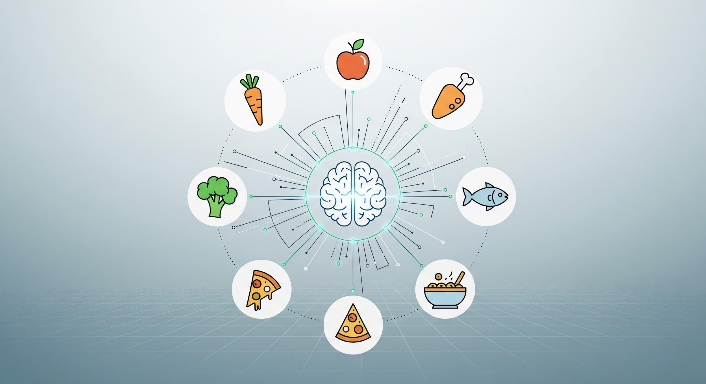

# Configurez votre Animoca Mind comme planificateur de repas personnalisé

Débloquez la puissance de l'IA pour optimiser votre parcours nutritionnel. Le Planificateur de Repas Animoca Mind exploite des capacités agentiques avancées pour générer des idées de repas personnalisées, créer des listes de courses pratiques et suivre vos objectifs nutritionnels — le tout adapté à vos préférences et restrictions alimentaires.

Que vous suiviez un régime keto, mangiez végétalien, gériez des allergies alimentaires ou souhaitiez simplement manger plus intentionnellement, votre Mind peut devenir un chef IA à la demande entièrement conçu autour de vos besoins.

## Ce dont vous avez besoin avant de commencer

La configuration ne prend que quelques minutes. Avant de commencer, ayez ces éléments prêts :

- Un compte [Animoca Mind](https://app.animocaminds.ai) actif
- Vos informations alimentaires de base — allergies, préférences (p. ex., végétarien, keto, méditerranéen) et objectifs de santé ou de remise en forme

Une fois que vous avez ces détails, vous êtes prêt à transformer votre Mind en un partenaire de planification de repas personnalisé.

## Étape 1 : Éveillez votre Mind

Si vous n'avez pas encore créé votre Mind, cela prend moins de 60 secondes. Visitez [animocaminds.ai](https://app.animocaminds.ai), saisissez votre e-mail et répondez au message de bienvenue de votre IA Conciergerie. Votre Mind sera prêt immédiatement.

Vous avez déjà un Mind ? Passez directement à l'Étape 2.

## Étape 2 : Équipez la compétence Planificateur de Repas

Dites à votre Mind d'équiper la compétence **Planificateur de Repas (Édition Chef Élite)** :

> *« Équipe-toi de Planificateur de Repas (Édition Chef Élite) »*

Votre Mind équipera la compétence automatiquement et confirmera quand il est prêt.

## Étape 3 : Configurez votre plan personnalisé

Donnez maintenant à votre Mind le contexte dont il a besoin pour construire un plan qui fonctionne pour vous :

**Durée du plan :** Combien de temps voulez-vous que le plan de repas dure ? Une semaine ? Un mois ?

**Votre emplacement :** Puisque le plan tient compte de la disponibilité du marché local, informez votre Mind de votre région ou pays.

**Préférences alimentaires — la partie importante :**
- Toute **allergie** (p. ex., gluten, noix, crustacés)
- Toute **restriction** (ingrédients ou méthodes de cuisson à éviter)
- Votre **style alimentaire** (Standard, Végétalien, Faible en glucides, Keto, Méditerranéen, etc.)
- Vos **objectifs de santé ou de remise en forme** (perte de poids, prise de muscle, nutrition équilibrée)

Plus vous donnez de contexte à votre Mind, plus votre plan sera précisément adapté.

## Étape 4 : Générez votre premier plan de repas

Une fois que votre Mind a tous les détails, dites-lui de générer votre premier plan de repas :

> *« Génère mon premier plan de repas basé sur les préférences que je t'ai données. »*

Revisez ce qu'il produit et n'hésitez pas à demander des modifications — votre Mind s'adapte en temps réel.

## Ce que votre Mind Planificateur de Repas peut faire

Votre Mind Planificateur de Repas agit comme un agent intelligent, pas une application statique. Voici ce qu'il gère automatiquement :

- **Apprend vos préférences** — mémorise vos restrictions alimentaires, cuisines préférées et habitudes culinaires entre les sessions
- **Automatise la planification hebdomadaire des repas** — élabore un menu varié avec des recettes complètes
- **Génère des listes de courses instantanées** — transforme votre plan de repas en liste de courses organisée
- **Suit les objectifs nutritionnels** — garde vos macros et objectifs en vue lors de la planification de chaque repas

## Laissez votre Mind gérer le travail répétitif

Animoca Minds est la façon la plus simple pour quiconque de mettre l'IA agentique au travail. Vous pouvez configurer votre Mind Planificateur de Repas en moins de 60 secondes — puis le laisser gérer votre routine nutritionnelle en arrière-plan pendant que vous vous concentrez sur ce qui compte.

**Commencer :** [animocaminds.ai](https://app.animocaminds.ai)

## Liens utiles

- [Animoca Minds](https://app.animocaminds.ai/)
- [Comment créer un agent IA en 60 secondes](https://x.com/AnimocaMinds/status/2036022580512239686)
- [Animoca Brands](https://www.animocabrands.com)
- [X — @AnimocaMinds](https://x.com/AnimocaMinds)

---
title: "Configurez votre Animoca Mind comme planificateur de repas personnalisé"
title_en: "Set Up Your Animoca Mind as a Personalized Meal Planner"
date: "2026-03-27"
author: "Animoca Minds"
language: "fr"
content_type: "article"
source_platform: "x"
source_url: "https://x.com/AnimocaMinds/status/2036744905054187670"
slug: "meal-planner-animoca-minds"
distributions:
  - platform: "x"
    url: "https://x.com/AnimocaMinds/status/2036744905054187670"
  - platform: "github"
    url: "https://github.com/AnimocaMinds/Animoca-Minds-Tips/blob/main/posts/2026/03/27-meal-planner-animoca-minds/fr.md"
tags:
  - animoca-minds
  - agentic-ai
  - meal-planner
  - skills
  - automation
  - productivity
---